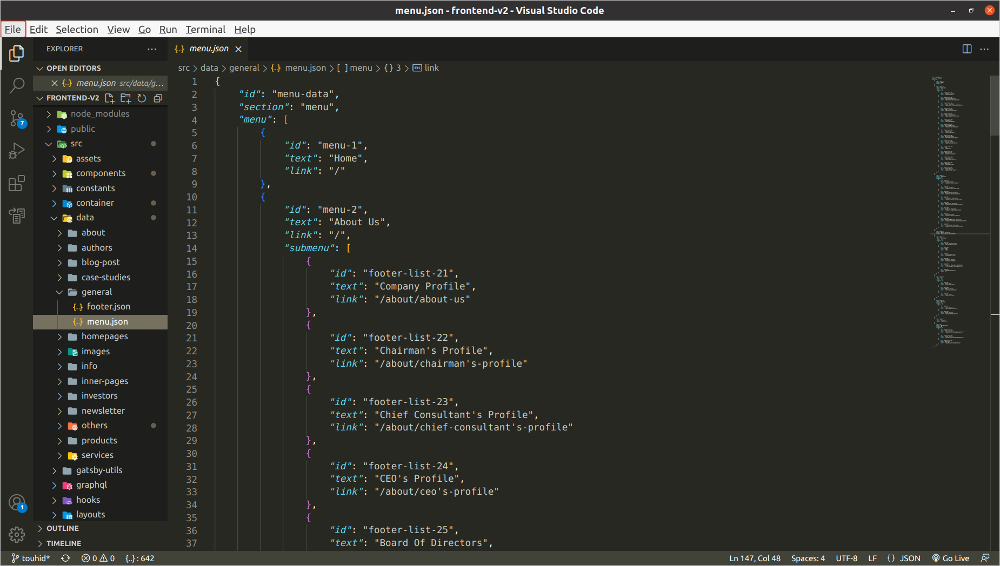

# Instruction for creating new page

## **Step 1:** Setting up your system environment

First install latest “Node.js” version for your windows PC from [here](https://nodejs.org/en/download/).

Now check, it installed or not.

Run the command

> node -v

You will see the latest node version like this

> v16.15.1

Open a new terminal and nevigate to the project directory.

> cd reliance-v2

And run the following command:

> npm install

Wait for it to be completed, it usually takes 5-10 minutes(or less) to complete.

## Start Development Server

Run the command

> npm start

**Note:** You must keep the development server running in a seperate terminal as long as you are performing any react native development tasks.
You need to keep this open in case of running or building the app from command line tools.

> You will see a link like this: http://localhost:8000/ in your terminal

> open this link in your browser and your will see your project live in your browser.

## **Step 2:** Adding new page

First download Visual studio code from [here](https://code.visualstudio.com/download) in your PC.

Open your project file in Visual Studio Code.

Then you will find a “src” folder in your project file

> src
> 

**Then you will find a folder named “pages” in “src” folder**

> pages
> 

**Open it, and you will find a bunch of files. All these files are the files of pages of your website. Then you will find a file, named “samplePage.jsx”, which is your desired file for creating a new page.**


**Now create a copy of the “samplePage.jsx” in pages folder and rename it as your new page name like “newPage.jsx”**

```html
/* eslint-disable react/prop-types */
import { graphql } from "gatsby";
import { Container } from "react-bootstrap";
import Layout from "@layout";
import { normalizedData } from "@utils/functions";
import { useEffect, useState } from "react";
import Preload from "../components/preloadPage/preload";
import Image from "./../data/images/blog/Engi@4x.png";

1: const SamplePage = ({ data }) => {
    const [preload, setPreload] = useState(true);
    const globalContent = normalizedData(data?.allGeneral?.nodes || []);

    useEffect(() => {
        setPreload(false);
    }, []);

    return (
        <Layout
            data={{
                ...globalContent["menu"],
                ...globalContent["footer"],
            }}
        >
            {" "}
            {preload && <Preload />}
            <Container>
                {/* You can start code here */}

                <h1 style={{ textAlign: "center" }}>This is your heading</h1>
                <p style={{ textAlign: "center" }}>This is your paragraph</p>
                
            </Container>
        </Layout>
    );
};

export const query = graphql`
2:    query SamplePageQuery {
        allGeneral {
            nodes {
                section
                id
                menu {
                    ...Menu
                }
                footer {
                    ...Footer
                }
            }
        }
        allArticle {
            nodes {
                ...Articles
            }
        }
    }
`;

3: export default SamplePage;

```

> **Note:** Rename three places in the file as your page name, where 1, 2, 3 number are located, on those lines.

Now your new page is ready to see.

open your browser and type in URL

> http://localhost:8000/newPage

And you will see the new page with a heading, a paragraph and an image.

Now you can coustomize this page as you want by coading in the container tag.

```html
<Container>
    {/* You can start code here */}

    <h1 style={{ textAlign: "center" }}>This is your  	heading</h1>
    <p style={{ textAlign: "center" }}>This is your paragraph</p>
    
</Container>
```

## **Step 3:** Adding the new page link to the menu

You will find a folder named "data" in the "src" folder. Open it, and there is a "generel" folder in that "data" folder



In that "general" folder you will find json data file for "menu" and "footer". Now you can add this new page link any where in these json data files.

An example is provided for understanding

>     	{
>            "id": "menu-6",
>            "text": "Info",
>           "link": "/",
>           "submenu": [
>                {
>                   "id": "menu-61",
>                   "text": "Agent info",
>                   "link": "/info/agent-info"
>                },
>                {
>                    "id": "menu-62",
>                    "text": "BOD Executives",
>                    "link": "/info/bod-executives"
>                },
>                {
>                    "id": "menu-63",
>                    "text": "Claim Info",
>                    "link": "/info/claim-info"
>                }
>           ]
>        },

In menu.json file, you will find an object with "id": "menu-6", there is "submenu" property in that object, which is an array of three object.

> **Note:** array enclosed in [] , and object enclosed in {} .

Now add forth object in "submenu" array like this:

>     	{
>            "id": "menu-6",
>            "text": "Info",
>            "link": "/",
>            "submenu": [
>                {
>                    "id": "menu-61",
>                    "text": "Agent info",
>                    "link": "/info/agent-info"
>                },
>                {
>                    "id": "menu-62",
>                    "text": "BOD Executives",
>                    "link": "/info/bod-executives"
>                },
>                {
>                    "id": "menu-63",
>                    "text": "Claim Info",
>                    "link": "/info/claim-info"
>                },
>                {
>                    "id": "menu-64",
>                    "text": "New Page",
>                    "link": "/newPage"
>                }
>            ]
>        },

In this format,

=> "id" is the key identification of that item. And it must be unique for every item.

> "id": "menu-64",

=> "text" is the name of the menu item.

> "text": "New Page",

=> "link" is the page route link. Which we discussed earlier.

> "link": "/newPage"
