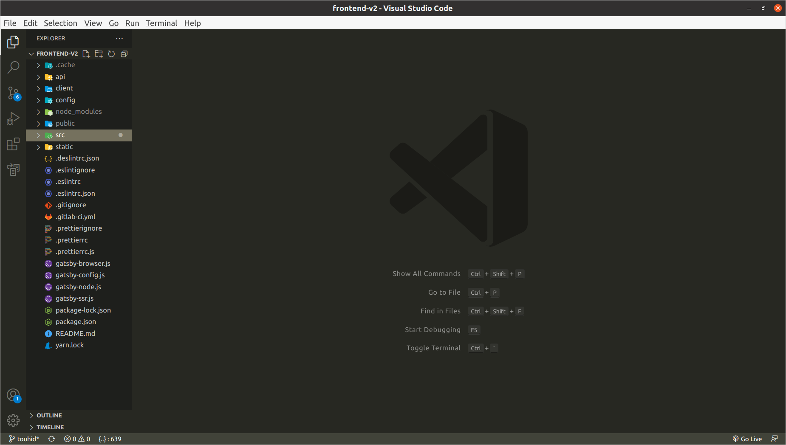
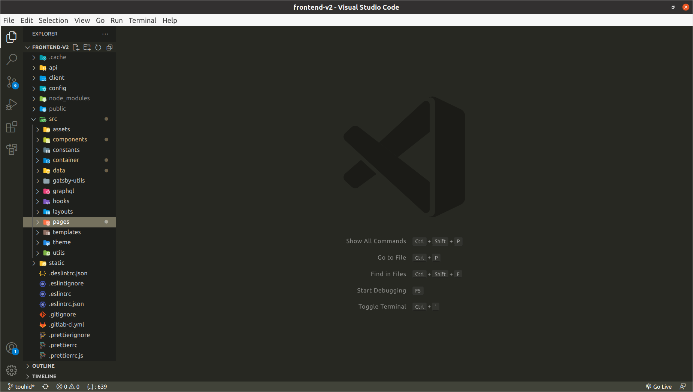
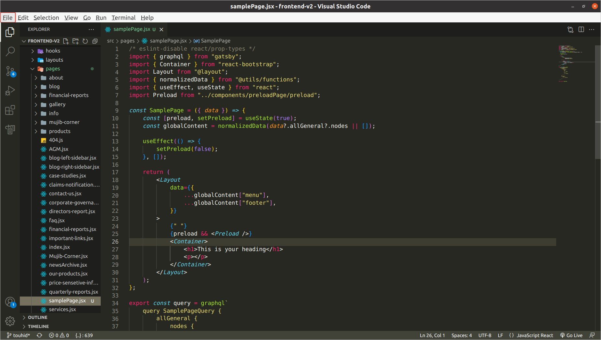

# Instruction for creating new page

**Step 1:** First install “Node Package Manager(npm)” in your PC

> Use “npm install” this command in your terminal

**Step 2:** Open your project file in VS code

**Step 3:** Then you will find a “src” folder in your project file

**=> Then you will find a folder named “pages” in “src” folder**

**=> Open it, and you will find a bunch of files. All these files are the files of pages of your website. Then you will find a file, named “samplePage.jsx”, which is your desired file for creating a new page.**

**Step 4:** Now create a copy of the “samplePage.jsx” in pages folder and rename it as your new page like “newPage.jsx”
