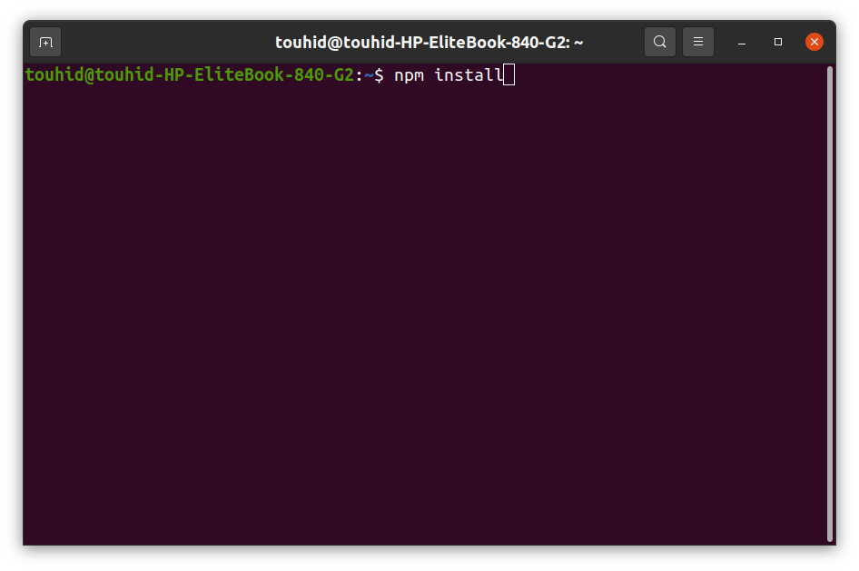

# Instruction for creating new page

## **Step 1:** Setting up your system environment

=> First install “Node Package Manager(npm)” in your PC.

=> Run the command “npm install” in your terminal to install “Node Package Manager".

> npm install

<!--  -->

=> Then go to the directory file of your project. Such as:

> cd home/reliance/

=>And install "yarn" in your project. For installing yarn run this command below:

> /home/reliance npm install --global yarn

Wait for it to be completed, it usually takes 5-10 minutes(or less) to complete.

## Start Development Server

=> Open a new terminal and nevigate to the project directory.

Run the command

> yarn start

**Note:** You must keep the development server running in a seperate terminal as long as you are performing any react native development tasks.
You need to keep this open in case of running or building the app from command line tools.

> You will see a link like this: http://localhost:8000/ in your terminal

> open this link in your browser and your will see your project live in your browser.

## **Step 2:** Adding new page

First download Visual studio code from [here](https://code.visualstudio.com/download) in your PC.

Open your project file in Visual Studio Code.

Then you will find a “src” folder in your project file

> src
> 

**Then you will find a folder named “pages” in “src” folder**

> pages
> 

**Open it, and you will find a bunch of files. All these files are the files of pages of your website. Then you will find a file, named “samplePage.jsx”, which is your desired file for creating a new page.**


**Now create a copy of the “samplePage.jsx” in pages folder and rename it as your new page like “newPage.jsx”**

```html
/* eslint-disable react/prop-types */
import { graphql } from "gatsby";
import { Container } from "react-bootstrap";
import Layout from "@layout";
import { normalizedData } from "@utils/functions";
import { useEffect, useState } from "react";
import Preload from "../components/preloadPage/preload";
import Image from "./../data/images/blog/Engi@4x.png";

1: const SamplePage = ({ data }) => {
    const [preload, setPreload] = useState(true);
    const globalContent = normalizedData(data?.allGeneral?.nodes || []);

    useEffect(() => {
        setPreload(false);
    }, []);

    return (
        <Layout
            data={{
                ...globalContent["menu"],
                ...globalContent["footer"],
            }}
        >
            {" "}
            {preload && <Preload />}
            <Container>
                {/* You can start code here */}

                <h1 style={{ textAlign: "center" }}>This is your heading</h1>
                <p style={{ textAlign: "center" }}>This is your paragraph</p>
                
            </Container>
        </Layout>
    );
};

export const query = graphql`
2:    query SamplePageQuery {
        allGeneral {
            nodes {
                section
                id
                menu {
                    ...Menu
                }
                footer {
                    ...Footer
                }
            }
        }
        allArticle {
            nodes {
                ...Articles
            }
        }
    }
`;

3: export default SamplePage;

```

> **Note:** Rename three places in the file as your page name, where 1, 2, 3 number are located on that line.

Now your new page is ready to see.

open your browser and type in URL

> http://localhost:8000/newPage

And you will see the new page with a heading, a paragraph and an image.

Now you can coustomize this page as you want by coading in the container tag.

```html
<Container>
    {/* You can start code here */}

    <h1 style={{ textAlign: "center" }}>This is your  	heading</h1>
    <p style={{ textAlign: "center" }}>This is your paragraph</p>
    
</Container>
```
